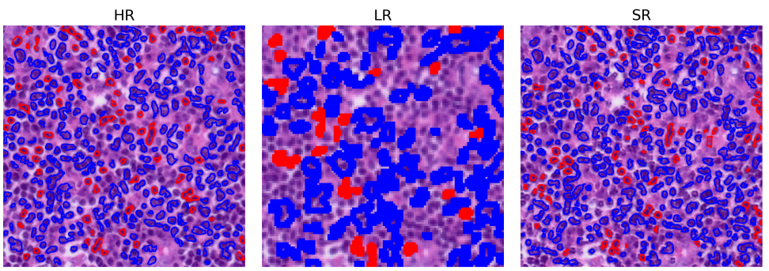
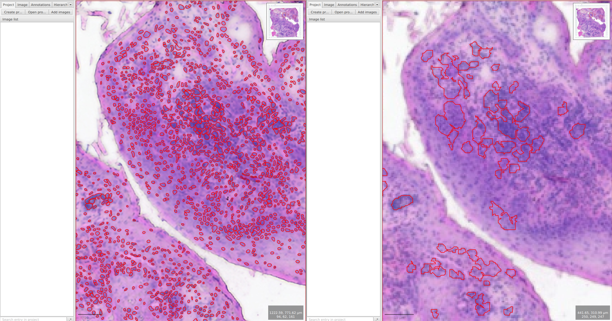

# HERestore: Deep Learning-Based H&E Image Enhancement for Visium

HERestore is a cutting-edge deep learning project designed to enhance the quality of Hematoxylin and Eosin (H&E) stained images obtained from Visium spatial transcriptomics. By leveraging advanced super-resolution techniques, HERestore transforms low-resolution H&E images into high-fidelity representations, enabling more accurate downstream analysis in biomedical research.

## 🎯 Motivation

H&E images obtained from Visium spatial transcriptomics platforms suffer from significant limitations due to their inherently low resolution. These low-resolution images pose critical challenges for downstream analysis:

- **Poor Cellular Detail**: The coarse resolution makes it difficult to distinguish individual cells and subcellular structures
- **Impaired Deep Learning Performance**: Standard deep learning models struggle to extract meaningful features from low-resolution inputs, leading to suboptimal performance in tasks like segmentation and classification
- **Cell Detection Limitations**: Accurate cell detection and counting become nearly impossible due to insufficient pixel density and blurred boundaries
- **Reduced Diagnostic Accuracy**: Pathologists and automated systems cannot reliably identify histological features, potentially leading to misdiagnoses or incomplete analyses

HERestore addresses these shortcomings by applying deep learning-based super-resolution to upscale low-resolution Visium H&E images by factors of 5x, 7x, and 14x. The enhanced high-resolution images enable:

- Clear visualization of cellular morphology and tissue architecture
- Improved performance of deep learning models for segmentation and feature extraction
- Reliable cell detection and quantification
- Enhanced diagnostic capabilities for spatial transcriptomics research

## 🚀 Features

- **Multi-Scale Super-Resolution**: Supports upsampling by factors of 5x, 7x, and 14x
- **Integrated Segmentation**: Includes a segmentation head for cell/nucleus detection at high resolution
- **PyTorch-Based Architecture**: Built with a pyramid residual network for robust feature extraction
- **Visium-Optimized**: Specifically trained on Visium H&E patches for optimal performance
- **Research-Focused**: Designed for biomedical research applications

## 📊 Model Architecture

HERestore employs a **PyramidSRSegModel** consisting of:

- **Shared LR Backbone**: 24 residual blocks with 96 feature channels
- **Multi-Head Upsampling**: Separate heads for 5x, 7x, and 14x super-resolution
- **Segmentation Head**: Convolutional network for high-resolution mask prediction
- **Residual Connections**: Enhanced feature propagation with residual scaling

### Key Components:
- `ResidualBlock`: Convolutional blocks with ReLU activation and residual scaling
- `UpsampleHead`: PixelShuffle-based upsampling with final 3x3 convolution
- `PyramidSRSegModel`: Main model integrating backbone, SR heads, and segmentation

## 🏋️ Training Details

- **Dataset**: ~19,000 H&E patches from Visium slides
- **Masks**: Generated using CellPose for accurate cell segmentation
- **Framework**: PyTorch with custom data loading and augmentation
- **Optimization**: Trained with focus on perceptual quality and segmentation accuracy

**Note**: The trained model weights are not included in this repository as the project is currently under publication review.

## 📈 Results

HERestore demonstrates significant improvements in H&E image quality:

- Enhanced resolution and clarity for better cellular detail visualization
- Accurate segmentation masks for downstream analysis
- Maintained histological features across multiple scales
- Improved cell detection performance with deep learning models like CellViT++

### Cell Detection Improvement using DeepLIIF:

*Comparison of Low-Resolution, Super-Resolution (HERestore), and High-Resolution H&E images*

### Cell Detection Improvement using CellVit++ visualized on QuPath:

*Comparison of cell detection performance: Number of cells detected by CellViT++ on Super-Resolution vs Low-Resolution images. HERestore enables significantly more accurate cell quantification.*
